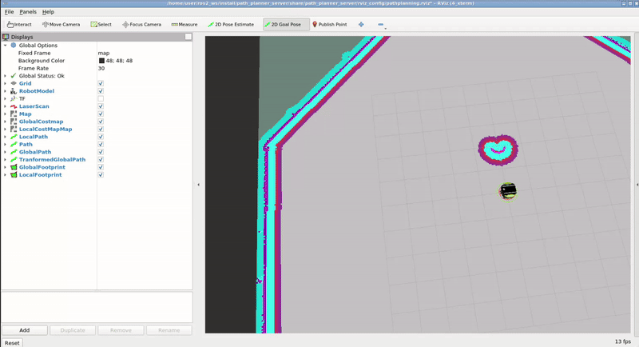
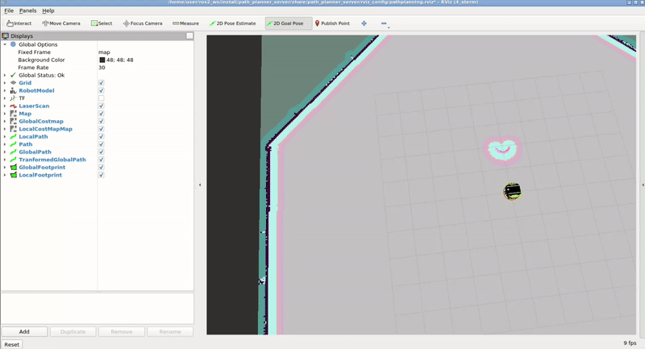

# Checkpoint 18 - Path Planning Project

End-to-end **Nav2 autonomous navigation stack** for the **Neobotix MP-400** mobile robot, featuring a **custom `nav2_core::GlobalPlanner` plugin implementing Dijkstra's shortest-path algorithm** directly on the `nav2_costmap_2d` occupancy grid. The project wires together the full ROS 2 Nav2 pipeline: **Cartographer SLAM** for map building, a **`nav2_map_server` + AMCL** localization stack, and a **planner + controller + recoveries + BT navigator** server set driven by a custom Dijkstra plugin. The custom planner expands 8-connected neighbors, rejects obstacle-cost cells (`cost ∈ [1, 254]`), backtracks parents from goal to start, and converts grid indices back to world waypoints for the `nav_msgs/Path` returned to the BT navigator.

<p align="center">
  
</p>

## How It Works

<p align="center">
  
</p>

### Mapping Phase (`cartographer_slam`)

1. `cartographer.launch.py` spawns three nodes: `cartographer_node`, `occupancy_grid_node` (`resolution = 0.05 m`, `publish_period = 1 s`), and `rviz2`
2. `config/cartographer.lua` configures 2D SLAM against the `base_footprint` tracking frame with `published_frame = odom`, `use_odometry = true`, a single laser scan, range `[0.1, 30 m]` and `use_online_correlative_scan_matching = true`
3. The generated map is saved to `map_server/maps/` as `neo_track1*.{pgm,yaml}` / `neobotix_area.{pgm,yaml}`

### Map Serving Phase (`map_server`)

- `nav2_map_server.launch.py` serves a saved PGM/YAML map under a `nav2_lifecycle_manager` (`autostart: true`, manages `[map_server]`) together with a preconfigured RViz view

### Localization Phase (`localization_server`)

- `localization.launch.py` brings up `nav2_map_server` + `nav2_amcl` + `nav2_lifecycle_manager` (managing `[map_server, amcl]`) against `amcl_config.yaml` and the cropped Neobotix track map

### Planning & Control Phase (`path_planner_server`)

`pathplanner.launch.py` spawns five Nav2 nodes under a single `nav2_lifecycle_manager` (`autostart: true`):

1. **`controller_server`** — DWB local planner at `controller_frequency = 2 Hz`, `max_vel_x = 0.26 m/s`, `max_vel_theta = 1.0 rad/s`, `xy_goal_tolerance = 0.25 m`, `yaw_goal_tolerance = 0.25 rad`
2. **`planner_server`** — `expected_planner_frequency = 1 Hz`, `planner_plugins: [GridBased]` wired to `nav2_dijkstra_planner/DijkstraGlobalPlanner` (the custom plugin). The global costmap runs `static_layer + obstacle_layer + inflation_layer` at `resolution = 0.05 m` with `robot_radius = 0.3 m`, `inflation_radius = 0.55 m`, `cost_scaling_factor = 3.0`
3. **`recoveries_server`** — behavior recoveries
4. **`bt_navigator`** — consumes the behavior tree in `config/behavior.xml`
5. **`rviz2`** — pre-configured pathplanning view

### Custom Dijkstra Planner Plugin (`nav2_dijkstra_planner`)

Class `nav2_dijkstra_planner::DijkstraGlobalPlanner` subclasses `nav2_core::GlobalPlanner` and exports itself via a `pluginlib` manifest:

```xml
<library path="nav2_dijkstra_planner_plugin">
  <class name="nav2_dijkstra_planner/DijkstraGlobalPlanner"
         type="nav2_dijkstra_planner::DijkstraGlobalPlanner"
         base_class_type="nav2_core::GlobalPlanner"/>
</library>
```

Per lifecycle callback (`configure / activate / deactivate / cleanup`):

- `configure()` captures the parent lifecycle node, TF buffer, and `nav2_costmap_2d::Costmap2DROS`
- Reads `origin_x/y`, `width`, `height`, `resolution` from the underlying `Costmap2D` — these feed the world-to-grid and grid-to-world conversions

`createPlan(start, goal)` pipeline:

1. Bounds-check `start` and `goal` with `inGridMapBounds` against the costmap extents
2. Convert world → grid cell via `fromWorldToGrid`, then flatten to linear index via `gridCellxyToIndex`
3. Run `dijkstraShortestPath(start_index, goal_index, costmap_flat, shortest_path)`:
   - Priority queue held as a `vector<pair<int, double>>` of `(node_index, g_cost)`, `closed_list` as `unordered_set<int>`, parents as `unordered_map<int, int>`
   - `find_neighbors` walks the 8 surrounding cells, rejecting any whose costmap value is in `[1, 254]` (obstacle / inflated / lethal) and using `diagonal_step_cost = resolution · √2` vs. straight-step cost `= resolution`
   - Parent backtracking from goal reconstructs the shortest path
4. Convert each grid index back to a world waypoint via `fromIndexToGridCellxy` → `fromGridToWorld`, wrap each as a `geometry_msgs/PoseStamped`, append to `nav_msgs/Path` and return

## Tasks Breakdown

### Task 1 — Cartographer SLAM (`cartographer_slam`)

- Python-launched `cartographer_node` + `occupancy_grid_node` + RViz
- Lua config: 2D SLAM, laser-only, online correlative scan matching, IMU disabled
- Output saved under `map_server/maps/` for downstream reuse

### Task 2 — Map Server (`map_server`)

- `nav2_map_server.launch.py` under `nav2_lifecycle_manager` (autostart)
- Ships three pre-built maps for the Neobotix environment (`neo_track1`, `neo_track1_cropped`, `neobotix_area`)

### Task 3 — AMCL Localization (`localization_server`)

- `localization.launch.py` bundles `map_server` + `amcl` + `nav2_lifecycle_manager`
- Two AMCL parameter files: `amcl_config.yaml` (default) and `amcl_barista_demo.yaml`

### Task 4 — Custom Dijkstra Global Planner (`nav2_dijkstra_planner`)

- `nav2_core::GlobalPlanner` subclass exported via `pluginlib`
- 8-connected Dijkstra on the costmap flat array, obstacle cost rejection `[1, 254]`, diagonal cost = `r·√2`
- Registered in `path_planner_server/config/planner_server.yaml` under `planner_plugins: [GridBased]` → `nav2_dijkstra_planner/DijkstraGlobalPlanner`

### Task 5 — Path Planner Server (`path_planner_server`)

- `controller_server` (DWB) + `planner_server` (custom Dijkstra) + `recoveries_server` + `bt_navigator` + `rviz2`, all under a single `nav2_lifecycle_manager`
- Behavior tree: `config/behavior.xml`
- Costmap: `static + obstacle + inflation` with `robot_radius = 0.3 m`, `inflation_radius = 0.55 m`, `LaserScan` observations on `/scan` (`raytrace_max_range = 3.0 m`, `obstacle_max_range = 2.5 m`)

### Task 6 — Combined Navigation (`neo_nav2`)

- `neo_nav2_full.launch.xml` chains `localization.launch.py` + `pathplanner.launch.py` — a single entry point for the full stack

## ROS 2 Interface

| Name | Type | Description |
|---|---|---|
| `/map` | `nav_msgs/OccupancyGrid` (pub) | Static map served by `nav2_map_server` |
| `/amcl_pose` | `geometry_msgs/PoseWithCovarianceStamped` (pub) | AMCL pose estimate |
| `/initialpose` | `geometry_msgs/PoseWithCovarianceStamped` (sub) | Initial pose hint from RViz |
| `/goal_pose` | `geometry_msgs/PoseStamped` (sub) | BT navigator goal input |
| `/plan` | `nav_msgs/Path` (pub) | Global path from the custom Dijkstra planner |
| `/cmd_vel` | `geometry_msgs/Twist` (pub) | DWB controller output |
| `/scan` | `sensor_msgs/LaserScan` (sub) | Obstacle observations into the global costmap |
| `/global_costmap/costmap` | `nav_msgs/OccupancyGrid` (pub) | Global costmap (static + obstacle + inflation) |
| `/behavior_server/*`, `/recoveries_server/*` | action set | Recovery behaviors |
| `/navigate_to_pose` | `nav2_msgs/NavigateToPose` (action) | BT navigator entry action |

## Project Structure

```
path_planning_checkpoint/
├── cartographer_slam/             # Task 1: Cartographer 2D SLAM
│   ├── launch/cartographer.launch.py
│   ├── config/cartographer.lua
│   └── rviz_config/
├── map_server/                    # Task 2: Map serving + saved maps
│   ├── launch/nav2_map_server.launch.py
│   └── maps/                      # neo_track1(.cropped), neobotix_area
├── localization_server/           # Task 3: map_server + AMCL + lifecycle_manager
│   ├── launch/localization.launch.py
│   └── config/amcl_config.yaml, amcl_barista_demo.yaml
├── nav2_dijkstra_planner/         # Task 4: Custom Dijkstra GlobalPlanner plugin
│   ├── include/nav2_dijkstra_planner/nav2_dijkstra_planner.hpp
│   ├── src/nav2_dijkstra_planner.cpp
│   ├── nav2_dijkstra_planner_plugin.xml
│   ├── CMakeLists.txt
│   └── package.xml
├── path_planner_server/           # Task 5: Planner + Controller + Recoveries + BT
│   ├── launch/pathplanner.launch.py
│   ├── config/planner_server.yaml        # Wires the custom Dijkstra plugin
│   ├── config/controller.yaml            # DWB local planner
│   ├── config/bt_navigator.yaml
│   ├── config/behavior.xml
│   ├── config/recovery.yaml
│   └── rviz_config/
├── neo_nav2/                      # Task 6: Combined stack entry point
│   └── launch/neo_nav2_full.launch.xml
├── parameter_tests/
└── media/
```

## How to Use

### Prerequisites

- ROS 2 Humble
- Nav2 (`nav2_bringup`, `nav2_planner`, `nav2_controller`, `nav2_bt_navigator`, `nav2_recoveries`, `nav2_lifecycle_manager`, `nav2_amcl`, `nav2_map_server`, `nav2_costmap_2d`, `nav2_core`)
- `cartographer_ros`, `cartographer`
- `neo_simulation2` (Neobotix MP-400 simulation — sibling workspace package)
- `pluginlib`, `tf2_ros`, `geometry_msgs`, `nav_msgs`, `sensor_msgs`, `visualization_msgs`

### Build

```bash
cd ~/ros2_ws
colcon build --symlink-install
source install/setup.bash
```

### Simulation — Mapping (Task 1)

```bash
# Terminal 1 — Neobotix MP-400 simulation
ros2 launch neo_simulation2 simulation.launch.py

# Terminal 2 — Cartographer SLAM + RViz
ros2 launch cartographer_slam cartographer.launch.py

# Terminal 3 — drive the robot with teleop
ros2 run teleop_twist_keyboard teleop_twist_keyboard

# When the map looks good, save it
ros2 run nav2_map_server map_saver_cli -f ~/ros2_ws/src/path_planning_checkpoint/map_server/maps/my_map
```

### Simulation — Full Navigation (Tasks 3–6)

```bash
# Terminal 1 — Neobotix MP-400 simulation
ros2 launch neo_simulation2 simulation.launch.py

# Terminal 2 — full Nav2 stack (localization + planner/controller/recoveries/BT + RViz)
ros2 launch neo_nav2 neo_nav2_full.launch.xml
```

Then in RViz:
1. Click **2D Pose Estimate** and place the robot on its real starting pose
2. Click **2D Goal Pose** to send a goal — the custom Dijkstra plugin returns a global `/plan`, DWB tracks it on `/cmd_vel`

### Sanity checks

```bash
# Planner + controller lifecycle
ros2 lifecycle get /planner_server
ros2 lifecycle get /controller_server
ros2 lifecycle get /bt_navigator

# Check that the custom plugin is the active global planner
ros2 param get /planner_server GridBased.plugin
#   "nav2_dijkstra_planner/DijkstraGlobalPlanner"

# Watch the generated plan
ros2 topic echo /plan --once
```

## Key Concepts Covered

- **Nav2 plugin authoring**: implementing `nav2_core::GlobalPlanner` (`configure / activate / deactivate / cleanup / createPlan`), exporting through a `pluginlib` XML manifest, registering in `planner_server.yaml`
- **Costmap manipulation**: flattening `nav2_costmap_2d::Costmap2D` into a flat array, world-to-grid / grid-to-world / grid-to-index conversions, obstacle cost thresholds `[1, 254]`
- **Dijkstra's algorithm on an occupancy grid**: 8-connected neighbors, diagonal cost `r·√2`, parent backtracking, open/closed lists
- **Nav2 lifecycle orchestration**: `nav2_lifecycle_manager` with `autostart` and `node_names` to bring up a set of managed nodes in the correct order
- **Full Nav2 stack**: AMCL ↔ `map_server` for localization; `planner_server` + `controller_server` + `recoveries_server` + `bt_navigator` for navigation; behavior tree XML for sequencing
- **2D SLAM**: Cartographer with `trajectory_builder_2d`, correlative scan matching, occupancy grid generation
- **Costmap layers**: `StaticLayer`, `ObstacleLayer` (`LaserScan` observations, raytrace/obstacle ranges), `InflationLayer` (`inflation_radius`, `cost_scaling_factor`)
- **DWB local planner**: trajectory critics (`RotateToGoal`, `ObstacleFootprint`, `GoalAlign`, `PathAlign`, `PathDist`, `GoalDist`)

## Technologies

- ROS 2 Humble
- Nav2 (`nav2_core`, `nav2_costmap_2d`, `nav2_planner`, `nav2_controller`, `nav2_bt_navigator`, `nav2_recoveries`, `nav2_amcl`, `nav2_map_server`, `nav2_lifecycle_manager`, `nav2_util`)
- Google Cartographer 2D SLAM
- `pluginlib` (for the custom global planner)
- DWB local planner
- Neobotix MP-400 simulation (`neo_simulation2`)
- C++ 17 / Python 3 / Lua (Cartographer config) / XML (pluginlib manifest + BT)
